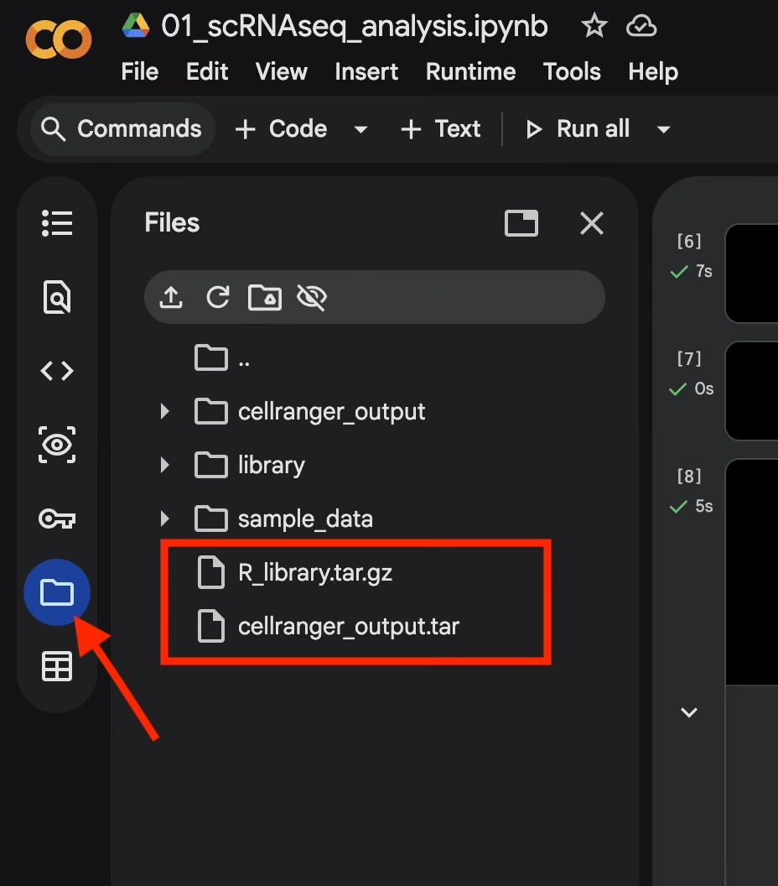

# Downstream Single-Cell RNA-seq Analysis Using the Seurat Pipeline in Google Colab

This page continues the use of Google Colab to run the Seurat downstream analysis pipeline from the seurat output generated in [Day 1](./Processing_scRNAseq_Raw_Data.md). By the end of this setup, you'll have a Colab environment with R, Seurat, and your data ready for analysis.

## Prerequisites

- A personal Google account (for Google Colab and Google Drive)
- Completed [Day 1: Processing Raw scRNA-seq Data with Cell Ranger](./Processing_scRNAseq_Raw_Data.md), or access to the pre-generated `obj_combined.integrated_40res.rds` file
- A modern web browser

---

## Step 1: Log In to Google Colab

Go to [colab.research.google.com](https://colab.research.google.com) and sign in with your personal Google account.

## Step 2: Download and Open the Analysis Notebook

Download the workshop notebook — **[`02_scRNAseq_analysis.ipynb`](02_scRNAseq_analysis.ipynb)** — and open it in Google Colab (**File → Upload notebook**, or drag and drop the file into the Colab interface).

## Step 3: Copy the R Library and Seurat Output from UVA Box

From the [Bioinformatics Workshop Box folder](https://virginia.app.box.com/folder/395515355319), download the following two files:

- `R_library.tar.gz` — pre-built R package library (Seurat and dependencies), so you don't need to install packages from scratch in Colab
- `obj_combined.integrated_40res.rds` — the Seurat output generated in Day 1

## Step 4: Upload the Files to Colab

In the Colab interface, open the **Files** panel (folder icon on the left sidebar) and upload both `R_library.tar.gz` and `obj_combined.integrated_40res.rds` directly into the root session storage.

  

> **Note:** Colab session storage is temporary — files are cleared when the runtime disconnects or resets. If your session restarts, re-upload both files before continuing.

---

Once both files are uploaded, continue to the analysis cells in `02_scRNAseq_analysis.ipynb` to extract the library and data, load the R object output into Seurat, and begin the downstream processing like marker analysis, cell type annotation steps covered on Day 2 of the workshop.
